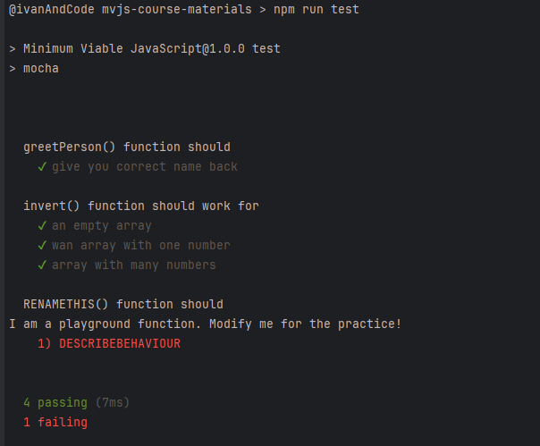

# Minimum Viable JavaScript
## Purpose of this repo
This repo contains the supporting code and materials for the "Minimum Viable JavaScript" course.  
Important parts are:
- `greet.js` file and the matching test file `./test/greet.test.js`
- `invert.js` file and the matching test file `./test/invert.test.js`
- ...and the playground

## Running the tests
- `npm install` to install the dependencies
- `npm run test` to run all tests
  

## Playground
`playground.js`  
This file and the matching test have been created to help you train. Think of them as scaffolding. A playground. A place to mess around and play!

| Note: The test has been setup to fail intentionally! Fix it!  
When you are solving other challenges, you could do it with the help of this file (or create a separate one + the test)

## Useful commands
These are the commands cheat sheet. These commands were used as part of the course:

| command       | purpose/explanation                                        | 
|---------------|------------------------------------------------------------|
| node hello.js | run the file `hello.js` with node.js                       |
| node -v       | 	display installed node.js version                         |
| npm -v        | display installed npm version                              |
| npm init      | 	initialize a new package (project)                        |
| npm run hello | 	run a script from package.json named “hello”              |
| npm run test  | 	run a script from package.json named “test”               |
| npm install   | 	install the dependencies, packages listed in package.json |